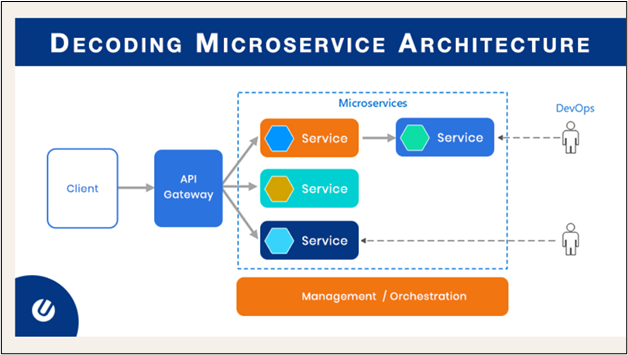

# 📚 Distributed Operating System Course Project  
## 🧩 Microservices Architecture

This project demonstrates a simple microservices-based bookstore system using **Node.js**, **Express**, **SQLite**, and **Docker**.  
It’s designed for educational purposes under the **Distributed Operating Systems** course.


---


### 🗂️ Services Overview

| Service         | Port  | Description                                  |
|-----------------|-------|----------------------------------------------|
| Catalog Service | 5001  | Manages books catalog (search, info, reserve)|
| Order Service   | 5002  | Handles book purchases and order storage     |
| Front-end       | 80    | (Optional) UI served via Nginx               |

Each service is isolated and communicates over REST APIs.


---
### 🏗️ Project Structure
/Dos-Project

│
├── catalog-service/
│ ├── catalog.js
│ └── data/
│ └── catalog.db
│
├── order-service/
│ ├── order.js
│ └── data/
│ └── orders.db
│
├── docker-compose.yml
│
├── nginx/
│ └── default.conf
│
├── images/
│ └── Microservices-architecture-diagram.png
│
├── Dos-Project.postman_collection.json
└── README.md
---

### ⚙️ Prerequisites

- Git & GitHub  
- SQLite3 Database  
- Docker & Docker Compose  
- Nginx  
- Node.js & Express  
- Postman

---

### ⚙️ Prerequisites

- ✅ Git & GitHub  
- ✅ Node.js & npm  
- ✅ SQLite3  
- ✅ Postman (for testing endpoints)  
- ✅ Docker & Docker Compose  
- ✅ Nginx (optional for UI)

---

### 🚀 How to Run Locally (without Docker)

1. **Clone the repo:**
```bash
git clone https://github.com/YasmineSaad79/Dos-Project.git
cd Dos-Project


